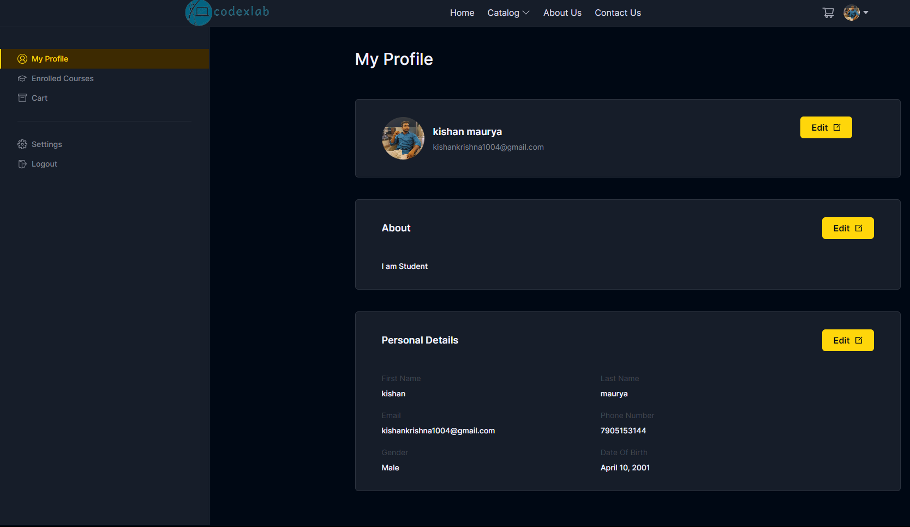

# CodexLab

CodexLab is a fully functional ed-tech platform that enables users to create, consume, and rate educational content. The platform is built using the MERN stack, which includes ReactJS, NodeJS, MongoDB, and ExpressJS.

CodexLab aims to provide :  
* A seamless and interactive learning experience for students, making education more accessible and engaging.
* A platform for instructors to showcase their expertise and connect with learners across the globe


# Features & Functionalities 
#### **Front-end**
To build the front end, we use frameworks and libraries such as ReactJS, which is a popular JavaScript library for building user interfaces. We also use CSS and Tailwind, which are styling frameworks that help make the user interface look good and responsive. Additionally, we use some npm packages to add extra functionality to the front end. To manage the state of the application, we use Redux, which is a popular state management library for React. Finally, we use a development environment called VSCode, which is a popular code editor, to develop the front end.
#### For Students:
* _Homepage_: This page will have a brief introduction to the platform, as well as links to the course list and user details.
* _Course List_: This page will have a list of all the courses available on the platform, along with their descriptions and ratings.
* _Wishlist_: This page will display all the courses that a student has added to their wishlist.
* _Cart Checkout_: This page will allow the user to complete the course purchase.
* _Course Content_: This page will have the course content for a particular course, including videos, and other related material.
* _User Details_: This page will have details about the student's account, including their name, email, and other relevant information.
* _User Edit Details_: This page will allow the student to edit their account details.
#### For Instructors:
* _Dashboard_: This page will have an overview of the instructor's courses, as well as the ratings and feedback for each course.
* _Insights_: This page will have detailed insights into the instructor's courses, including the number of views, clicks, and other relevant metrics.
* _Course Management Pages_: These pages will allow the instructor to create, update, and delete courses, as well as manage the course content and pricing.
* _View and Edit Profile Details_: These pages will allow the instructor to view and edit their account details.

#### **Back-end**
CodeLab uses a monolithic architecture, with the backend built using Node.js and Express.js, and MongoDB as the primary database. Monolithic architecture refers to a design approach where all the modules of the application are combined into a single large program, with a single codebase, to enable better control, security, and performance.               
Node.js is a popular JavaScript runtime that allows us to run JavaScript code outside of the browser. Express.js is a web application framework that simplifies the process of building web applications in Node.js. MongoDB is a popular NoSQL database that allows for flexible data storage and retrieval, making it a suitable choice for complex applications like CodeLab.     

* _User authentication and authorization_: Students and instructors can sign up and log in to the platform using their email addresses and password. The platform also supports OTP (One-Time Password) verification and forgot password functionality for added security.
* _Course management_: Instructors can create, read, update, and delete courses, as well as manage course content and media. Students can view and rate courses.
* _Payment Integration_: Students will purchase and enrol on courses by completing the checkout flow that is followed by Razorpay integration for payment handling.
* _Cloud-based media management_: StudyNotion uses Cloudinary, a cloud-based media management service, to store and manage all media content, including images, videos, and documents.

# Frameworks, Libraries, and Tools used:
The back end of CodexLab uses a range of frameworks, libraries, and tools to ensure its functionality and performance, including:
* _Node.js_: Node.js is used as the primary framework for the back end.
* _MongoDB_: MongoDB is used as the primary database, providing a flexible and scalable data storage solution.
* _Express.js_: Express.js is used as a web application framework, providing a range of features and tools for building web applications.
* _JWT_: JWT (JSON Web Tokens) are used for authentication and authorization, providing a secure and reliable way to manage user credentials.
* _Bcrypt_: Bcrypt is used for password hashing, adding an extra layer of security to user data.
* _Mongoose_: Mongoose is used as an Object Data Modeling (ODM) library, providing a way to interact with MongoDB using JavaScript.


## Installation
1. Clone the repository to your local machine.
```bash
git clone https://github.com/kishankrishna1/CodexLab.git
```
2. Install the required packages.
```bash
cd CodexLab
npm install
```
3. Start the development server.
```bash
npm run dev
```

## Environment Variables

To run this project, you will need to add the following environment variables to your .env file

`REACT_APP_BASE_URL`   
`REACT_APP_RAZORPAY_KEY` 


#### --server--
`MAIL_HOST`  
`MAIL_USER`    
`MAIL_PASS`        
`JWT_SECRET`   
`FOLDER_NAME`  
`RAZORPAY_KEY`               
`RAZORPAY_SECRET  `          
`CLOUD_NAME`    
`API_KEY`        
`API_SECRET`         
`MONGODB_URL`      
`PORT` 


# Screenshots

## Home Screen


## Profile Page


## Demo

Insert gif or link to demo

